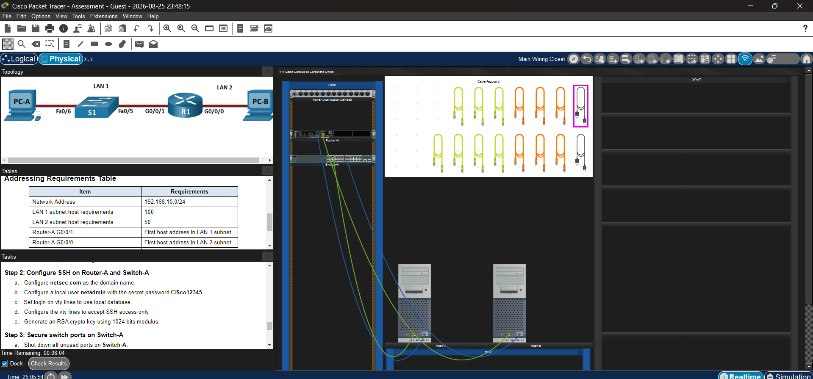

# Final Project 1: Secure Branch Office — SSH, VLSM & Port Security

## Overview
A branch office network build with VLSM-based subnetting, SSH-only remote management on both the router and switch, and unused switch ports disabled as a security measure. This project also includes the physical/structured cabling layer in Packet Tracer (rack, patch panel, wiring closet).

## Topology

**Devices:**
- **Router-A** — G0/0/1 → LAN 1 (via Switch-A Fa0/5), G0/0/0 → LAN 2 (Host-B)
- **Switch-A** — Fa0/6 → Host-A (LAN 1), uplinked to Router-A
- Base network: `192.168.10.0/24`, subnetted via VLSM

## Addressing Requirements

| Item | Requirement |
|---|---|
| Network Address | 192.168.10.0/24 |
| LAN 1 subnet host requirement | 100 |
| LAN 2 subnet host requirement | 50 |
| Router-A G0/0/1 | First host address in LAN 1 subnet |
| Router-A G0/0/0 | First host address in LAN 2 subnet |

This is a classic VLSM exercise: starting from a /24, the larger LAN (100 hosts) needs a /25 (126 usable hosts), and the smaller LAN (50 hosts) needs a /26 (62 usable hosts) carved out of the remaining space. Router-A's interfaces take the first usable address in each respective subnet.

## Key Configuration

**Router-A — Base Hardening:**

    Router(config)#no ip domain-lookup
    Router(config)#hostname Router-A
    Router-A(config)#banner motd "Warning! Only Authorized users"
    Router-A(config)#line console 0
    Router-A(config-line)#password C@nsPassw!
    Router-A(config-line)#login
    Router-A(config-line)#exit

**Router-A — Interfaces (VLSM-derived addressing):**

    Router-A(config)#interface g0/0/0
    Router-A(config-if)#ip address 192.168.10.126 255.255.255.128
    Router-A(config-if)#description Connected to PC-B

    Router-A(config)#interface g0/0/1
    Router-A(config-if)#ip address 192.168.10.129 255.255.255.192
    Router-A(config-if)#description Connected to S1 Fa0/5

**Router-A — SSH:**

    Router-A(config)#ip domain-name netsec.com
    Router-A(config)#username netadmin secret Ci$co12345
    Router-A(config)#crypto key generate rsa
       ! modulus: 1024
    Router-A(config)#line vty 0 15
    Router-A(config-line)#login local
    Router-A(config-line)#transport input ssh

**Switch-A — Base Hardening & Management SVI:**

    Switch(config)#no ip domain-lookup
    Switch(config)#hostname Switch-A
    Switch-A(config)#banner motd "Warning! Only Authorized users"
    Switch-A(config)#line console 0
    Switch-A(config-line)#password C@nsPassw!
    Switch-A(config-line)#login

    Switch-A(config)#interface vlan 1
    Switch-A(config-if)#description SVI for Management
    Switch-A(config-if)#ip address 192.168.10.2 255.255.255.128
    Switch-A(config-if)#no shutdown
    Switch-A(config)#ip default-gateway 192.168.10.126

**Switch-A — SSH:**

    Switch-A(config)#enable secret ThisisaSecret
    Switch-A(config)#service password-encryption
    Switch-A(config)#ip domain-name netsec.com
    Switch-A(config)#username netadmin secret Ci$co12345
    Switch-A(config)#crypto key generate rsa
       ! modulus: 1024
    Switch-A(config)#line vty 0 15
    Switch-A(config-line)#login local
    Switch-A(config-line)#transport input ssh

**Switch-A — Securing Unused Ports:**

    Switch-A(config)#interface range fa0/1-4, fa0/7-24, g0/1-2
    Switch-A(config-if-range)#description Unused Ports
    Switch-A(config-if-range)#shutdown

## Verification
- All unused FastEthernet/GigabitEthernet ports on Switch-A confirmed `administratively down` via console log output
- SSH access confirmed working to both Router-A and Switch-A using the `netadmin` local account
- VLSM subnet sizes matched the addressing requirements table
- Cabling physically verified in the Packet Tracer wiring-closet/rack view

## Skills Demonstrated
- VLSM subnetting to meet specific host-count requirements per LAN
- SSH configuration end-to-end (domain name, local database auth, RSA key generation, `transport input ssh`)
- Disabling unused switch ports as a security best practice
- Structured cabling / physical topology awareness in Packet Tracer
