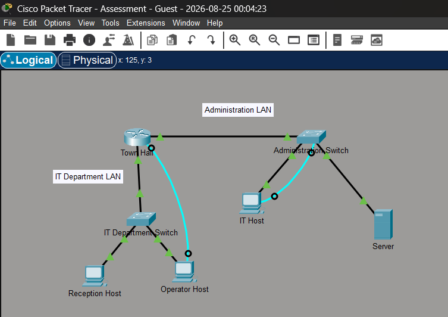

# Final Project 2: Town Hall Network — Router/Switch Security Hardening

## Overview
A small office network for a "Town Hall" site with two LANs (IT Department and Administration), built around a single multi-homed router. The focus of this project is security hardening: passwords, encrypted secrets, SSH remote access, banners, and dual-stack (IPv4 + IPv6) addressing.

## Topology

**Devices:**
- Router **Town-Hall** — connects the IT Department LAN and the Administration LAN
- **IT Department Switch** — Reception Host, Operator Host
- Switch **Switch_2** (Administration Switch) — IT Host, Server

## Addressing Table

| Device | Interface | IP Address/Mask | Default Gateway |
|---|---|---|---|
| Town-Hall | G0/0 | 192.168.1.126/27 | N/A |
| Town-Hall | G0/0 (IPv6) | 2001:db8:acad:a::1/64 | N/A |
| Town-Hall | G0/0 (link-local) | fe80::1 | N/A |
| Town-Hall | G0/1 | 192.168.1.158/28 | N/A |
| Town-Hall | G0/1 (IPv6) | 2001:db8:acad:b::1/64 | N/A |
| Town-Hall | G0/1 (link-local) | fe80::1 | N/A |
| Administration Switch (Switch_2) | SVI (VLAN 1) | 192.168.1.157/28 | 192.168.1.158 |
| IT Department Switch | NIC (Reception Host) | 192.168.1.97/27 | 192.168.1.126 |
| IT Department Switch | NIC (Operator Host) | 192.168.1.98/27 | 192.168.1.126 |
| Administration Switch | NIC (IT Host) | 192.168.1.145/28 | 192.168.1.158 |
| Server | NIC | 192.168.1.146/28 | 192.168.1.158 |

See [`subnetting-plan.xlsx`](./subnetting-plan.xlsx) for the full subnet breakdown (192.168.1.0/24, subnets of /27 and /28).

## Key Configuration

### Town-Hall Router — Initial Hardening

    Router(config)#hostname Town-Hall
    Town-Hall(config)#enable secret cisco12345
    Town-Hall(config)#line console 0
    Town-Hall(config-line)#password cisco12345
    Town-Hall(config-line)#login
    Town-Hall(config-line)#logging synchronous
    Town-Hall(config-line)#exit
    Town-Hall(config)#line vty 0 4
    Town-Hall(config-line)#password cisco12345
    Town-Hall(config-line)#login
    Town-Hall(config-line)#exit
    Town-Hall(config)#security passwords min-length 10
    Town-Hall(config)#service password-encryption

### Town-Hall Router — SSH Setup

    Town-Hall(config)#username netadmin secret Cisco_CCNA7
    Town-Hall(config)#ip domain-name avi.com
    Town-Hall(config)#crypto key generate rsa
       ! modulus: 1024  -> keys named Town-Hall.avi.com
    Town-Hall(config)#ip ssh version 2
    Town-Hall(config)#line vty 0 4
    Town-Hall(config-line)#login local
    Town-Hall(config-line)#transport input ssh

### Town-Hall Router — Interfaces (dual-stack)

    Town-Hall(config)#interface g0/0
    Town-Hall(config-if)#description Connected to IT Department Switch
    Town-Hall(config-if)#ip address 192.168.1.126 255.255.255.224
    Town-Hall(config-if)#ipv6 address 2001:db8:acad:a::1/64
    Town-Hall(config-if)#ipv6 address fe80::1 link-local
    Town-Hall(config-if)#no shutdown

    Town-Hall(config)#interface g0/1
    Town-Hall(config-if)#description Connected to Administration Switch
    Town-Hall(config-if)#ip address 192.168.1.158 255.255.255.240
    Town-Hall(config-if)#ipv6 address 2001:db8:acad:b::1/64
    Town-Hall(config-if)#ipv6 address fe80::1 link-local
    Town-Hall(config-if)#no shutdown

    Town-Hall(config)#ipv6 unicast-routing
    Town-Hall(config)#banner motd "warning!"

### Switch_2 (Administration LAN switch) — Management SVI

    Switch_2(config)#interface vlan 1
    Switch_2(config-if)#ip address 192.168.1.157 255.255.255.240
    Switch_2(config-if)#description SVI for Management
    Switch_2(config-if)#no shutdown
    Switch_2(config-if)#exit
    Switch_2(config)#ip default-gateway 192.168.1.158

    Switch_2(config)#line vty 0 15
    Switch_2(config-line)#password cisco12345
    Switch_2(config-line)#login
    Switch_2(config-line)#end

    Switch_2#copy run start

## Verification
- SSH login to the Town-Hall router succeeded from Operator Host using the `netadmin` account
- `show ip interface brief` confirmed G0/0 and G0/1 both up/up with the correct IPv4 addresses
- Switch_2's VLAN 1 SVI came up (`up/up`) and was reachable for remote management via its default gateway (Town-Hall's G0/1)
- Configuration saved on Switch_2 with `copy run start`

## Skills Demonstrated
- Router security hardening: enable secret, console/VTY passwords, minimum password length, `service password-encryption`
- SSH v2 configuration: local user database, domain name, RSA key generation, restricting VTY to SSH only
- Dual-stack (IPv4 + IPv6) interface addressing, including IPv6 link-local addresses
- `ipv6 unicast-routing` and IPv6-enabled interfaces
- Switch VLAN 1 SVI configuration and default gateway for remote management
- MOTD banners for legal/warning notices
