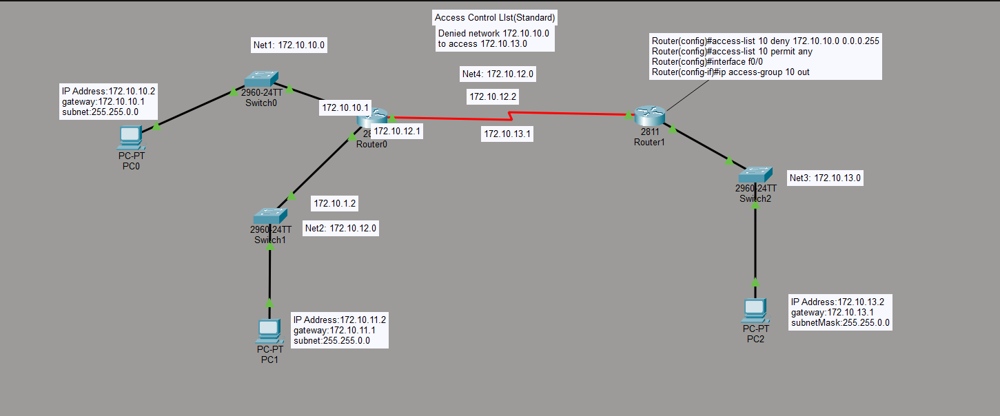

# Lab 01: Standard ACL Configuration

## Objective
Restrict traffic from the 172.10.10.0/24 network (PC0's subnet) so it cannot reach the 172.10.13.0/24 network (PC2's subnet), while allowing all other traffic to pass normally.

## Topology

**Devices:**
- Router0 (2811) — connects Switch0 (Net1), Switch1 (Net2), and Router1 (Net4)
- Router1 (2811) — connects to Router0 and Switch2 (Net3)
- PC0 — 172.10.10.2/16, gateway 172.10.10.1
- PC1 — 172.10.11.2/16, gateway 172.10.11.1
- PC2 — 172.10.13.2/16, gateway 172.10.13.1

## Key Configuration

    Router(config)#access-list 10 deny 172.10.10.0 0.0.0.255
    Router(config)#access-list 10 permit any
    Router(config)#interface f0/0
    Router(config-if)#ip access-group 10 out

The ACL is applied outbound on Router1's f0/0 interface (facing Net3 / PC2), so only traffic sourced from 172.10.10.0/24 is blocked from reaching that network. All other traffic is permitted by the implicit `permit any` statement.

## Verification
- PC0 (172.10.10.0/24) → PC2: ping fails (expected — denied by ACL)
- PC1 (172.10.11.0/24) → PC2: ping succeeds (expected — not matched by deny, falls through to permit any)

## Skills Demonstrated
- Standard numbered ACLs
- Wildcard masks
- Applying ACLs to an interface (in vs. out)
- Understanding the implicit deny and the need for an explicit `permit any`

## Notes / Things to Improve
- Standard ACLs filter by source only and should generally be placed close to the destination — this lab reinforces why the ACL was placed on Router1 (near Net3) rather than Router0.
