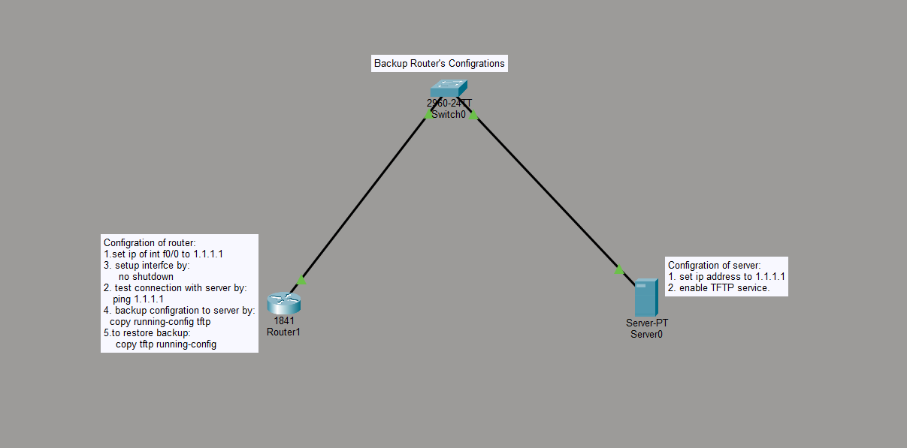

# Lab 02: Router Configuration Backup via TFTP

## Objective
Configure a router and a TFTP server so the router's running configuration can be backed up to the server and restored from it if needed.

## Topology

**Devices:**
- Router1 (1841) — connected to Switch0
- Server0 (TFTP server) — connected to Switch0

## Key Configuration

**Router:**

    Router(config)#interface f0/0
    Router(config-if)#ip address 1.1.1.1 255.255.255.0
    Router(config-if)#no shutdown

**Server:**
- IP address configured on the same subnet as the router
- TFTP service enabled

**Backup:**

    Router#copy running-config tftp

**Restore:**

    Router#copy tftp running-config

## Verification
- `ping 1.1.1.1` from the router to confirm connectivity to the server before attempting the backup
- Confirmed the config file appeared on the TFTP server after `copy running-config tftp`

## Skills Demonstrated
- Basic interface IP configuration
- TFTP server setup in Packet Tracer
- Backing up and restoring router configurations — a core operational/disaster-recovery skill

