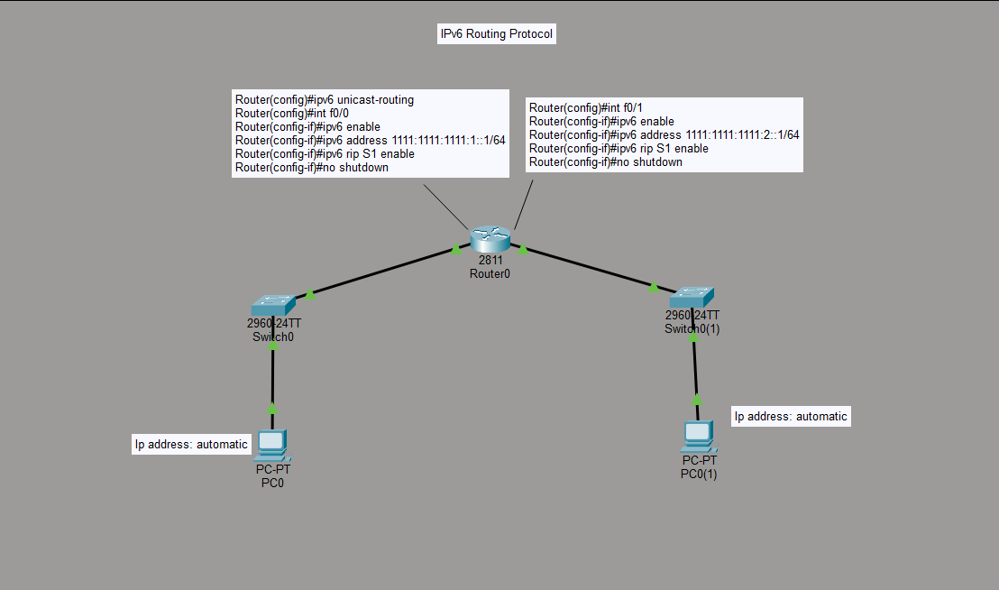

# Lab 03: IPv6 Routing with RIPng

## Objective
Enable IPv6 routing on a router with two LANs, configure IPv6 addressing on each interface, and enable RIPng (RIP for IPv6) so both LANs can route between each other. PCs obtain their IPv6 addresses automatically (SLAAC).

## Topology

**Devices:**
- Router0 (2811) — connects Switch0 (LAN 1) and Switch0(1) (LAN 2)
- PC0 — automatic (SLAAC) IPv6 address on LAN 1
- PC0(1) — automatic (SLAAC) IPv6 address on LAN 2

## Key Configuration

    Router(config)#ipv6 unicast-routing

    Router(config)#interface f0/0
    Router(config-if)#ipv6 enable
    Router(config-if)#ipv6 address 1111:1111:1111:1::1/64
    Router(config-if)#ipv6 rip S1 enable
    Router(config-if)#no shutdown

    Router(config)#interface f0/1
    Router(config-if)#ipv6 enable
    Router(config-if)#ipv6 address 1111:1111:1111:2::1/64
    Router(config-if)#ipv6 rip S1 enable
    Router(config-if)#no shutdown

## Verification
- `show ipv6 interface brief` — confirms both interfaces are up with correct IPv6 addresses
- `show ipv6 route rip` — confirms RIPng-learned routes (relevant with more than one router)
- PC0 and PC0(1) received IPv6 addresses automatically via SLAAC and could ping across the router

## Skills Demonstrated
- Enabling IPv6 routing globally (`ipv6 unicast-routing`)
- Interface-level IPv6 addressing
- Configuring RIPng as an IPv6 dynamic routing protocol
- SLAAC-based automatic addressing on end devices

## Notes
- `S1` in `ipv6 rip S1 enable` is just the process tag/name means it must match on every interface participating in the same RIPng process.
