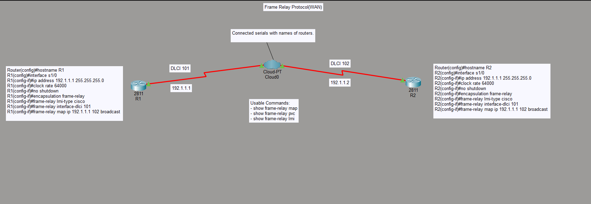

# Lab 04: Frame Relay WAN Configuration

## Objective
Connect two routers across a simulated Frame Relay WAN cloud, configuring encapsulation, LMI type, and DLCI-to-IP mapping so R1 and R2 can communicate over the serial link.

## Topology

**Devices:**
- R1 (2811) — Serial 1/0 → Cloud0 (DLCI 101)
- R2 (2811) — Serial 1/0 → Cloud0 (DLCI 102)
- Cloud-PT (Cloud0) — simulates the Frame Relay switch/cloud

## Key Configuration

**R1:**

    Router(config)#hostname R1
    R1(config)#interface s1/0
    R1(config-if)#ip address 192.1.1.1 255.255.255.0
    R1(config-if)#clock rate 64000
    R1(config-if)#no shutdown
    R1(config-if)#encapsulation frame-relay
    R1(config-if)#frame-relay lmi-type cisco
    R1(config-if)#frame-relay interface-dlci 101
    R1(config-if)#frame-relay map ip 192.1.1.2 102 broadcast

**R2:**

    Router(config)#hostname R2
    R2(config)#interface s1/0
    R2(config-if)#ip address 192.1.1.2 255.255.255.0
    R2(config-if)#clock rate 64000
    R2(config-if)#no shutdown
    R2(config-if)#encapsulation frame-relay
    R2(config-if)#frame-relay lmi-type cisco
    R2(config-if)#frame-relay interface-dlci 102
    R2(config-if)#frame-relay map ip 192.1.1.1 101 broadcast

## Useful Verification Commands

    show frame-relay map
    show frame-relay pvc
    show frame-relay lmi

## Verification
- `show frame-relay pvc` — confirms PVC status is ACTIVE on both routers
- `ping 192.1.1.2` from R1 and `ping 192.1.1.1` from R2 — confirms end-to-end connectivity across the cloud

## Skills Demonstrated
- Frame Relay encapsulation and LMI configuration
- DLCI-to-next-hop-IP mapping with `frame-relay map`
- Understanding of local significance of DLCIs (R1's DLCI 101 maps to R2's IP, R2's DLCI 102 maps to R1's IP)

